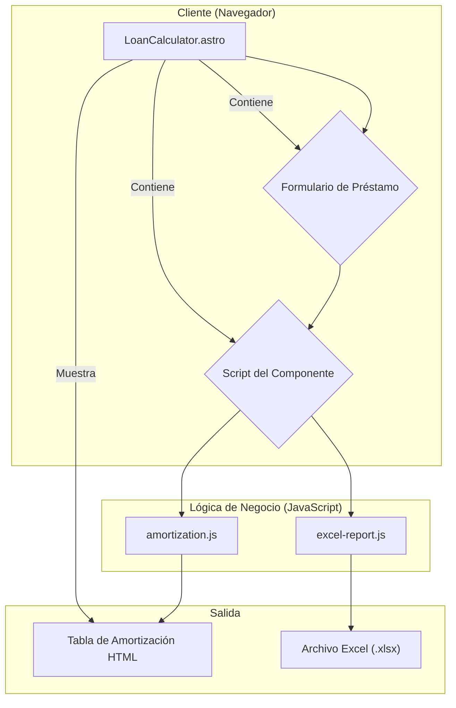
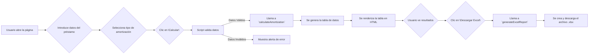

# Calculadora de Préstamos

Esta es una herramienta web para calcular y visualizar tablas de amortización de préstamos. Permite a los usuarios configurar diversos parámetros como el tipo de amortización, períodos de gracia, tiempo muerto y exportar los resultados a un archivo Excel.

## Características Principales

- **Tipos de Amortización:** Soporta los siguientes sistemas:
  - **Francés:** Cuotas constantes.
  - **Alemán:** Amortización de capital constante.
  - **Americano:** Pago de intereses periódicos y capital al final.
  - **Pago Único:** Un solo pago de capital e intereses al final del período.
- **Períodos de Pago Flexibles:** Permite configurar pagos diarios, mensuales, trimestrales, semestrales y anuales.
- **Períodos de Gracia y Tiempo Muerto:** Opción para incluir períodos donde solo se pagan intereses (gracia) o no se realiza ningún pago (muerto).
- **Aporte Fijo:** Incluye un cálculo de "Aporte / RS / JZ" (Responsabilidad Social / Juventud Zamorana) sobre el monto del préstamo.
- **Exportación a Excel:** Genera un informe detallado en formato `.xlsx` con el resumen y la tabla de amortización completa.
- **Interfaz Dinámica:** El formulario se ajusta según el tipo de amortización seleccionado.

## Arquitectura del Proyecto

El proyecto está construido con [Astro](https://astro.build/) y sigue una estructura simple y modular.

- **Frontend:** Se utiliza un único componente de Astro (`src/components/LoanCalculator.astro`) que contiene toda la UI (formulario y tabla de resultados) y el script del lado del cliente.
- **Lógica de Negocio:** La lógica para los cálculos de amortización está separada en módulos de JavaScript en el directorio `src/logic/`.
  - `amortization.js`: Contiene las funciones puras para cada tipo de cálculo (francés, alemán, etc.).
  - `excel-report.js`: Gestiona la creación y descarga del informe en Excel, utilizando la librería `xlsx`.
- **Dependencias:**
  - `astro`: El framework principal.
  - `xlsx`: Para la generación de archivos Excel.

### Diagrama de Arquitectura



## Diagrama de Flujo del Proyecto

El flujo de usuario y de datos es el siguiente:



## Instalación y Uso

1.  **Clonar el repositorio:**
    ```bash
    git clone <URL-DEL-REPOSITORIO>
    cd loan-calculator
    ```

2.  **Instalar dependencias:**
    ```bash
    npm install
    ```

3.  **Iniciar el servidor de desarrollo:**
    ```bash
    npm run dev
    ```
    La aplicación estará disponible en `http://localhost:4321`.

4.  **Generar un build de producción:**
    ```bash
    npm run build
    ```

## Testing

Para asegurar la calidad y la precisión de los cálculos, se propone una estrategia de testing utilizando **Vitest**, un framework de testing rápido y moderno compatible con Astro.

### ¿Por qué Vitest?

- **Integración nativa:** Funciona perfectamente con Vite, el motor que usa Astro.
- **Rápido:** Es extremadamente rápido gracias a su arquitectura.
- **API compatible con Jest:** Si estás familiarizado con Jest, la transición es muy sencilla.

### Implementación de Tests

1.  **Instalar Vitest:**
    ```bash
    npm install -D vitest
    ```

2.  **Añadir el script de test:**
    En tu archivo `package.json`, agrega el siguiente script:
    ```json
    "scripts": {
      // ... otros scripts
      "test": "vitest"
    }
    ```

3.  **Crear archivos de test:**
    Los tests se centrarán en la lógica de negocio en `src/logic/amortization.js`. Crea un archivo como `src/logic/amortization.test.js`.

4.  **Ejemplo de un test:**
    Este es un ejemplo de cómo se podría probar la función `calculateSinglePayment`:

    '''javascript
    // src/logic/amortization.test.js
    import { describe, it, expect } from 'vitest';
    import { calculateAmortization } from './amortization';

    describe('Calculadora de Amortización - Pago Único', () => {
      it('debería calcular correctamente el interés y el pago total para un pago único', () => {
        const options = {
          amount: 10000,
          interest: 10, // 10% fijo
          amortizationType: 'single',
          grantDate: '2025-09-25',
          singlePaymentDate: '2026-09-25',
          openingFee: 0
        };

        const table = calculateAmortization(options);

        expect(table).toHaveLength(1);
        const payment = table[0];

        expect(payment.principal).toBe(10000);
        expect(payment.interest).toBe(1000); // 10% de 10000
        expect(payment.payment).toBe(11000);
        expect(payment.remaining).toBe(0);
      });
    });
    '''

5.  **Ejecutar los tests:**
    ```bash
    npm run test
    ```

### Próximos Pasos en Testing

-   Añadir casos de prueba para los sistemas **francés, alemán y americano**.
-   Probar casos límite como **períodos de gracia y tiempo muerto**.
-   Verificar que la suma de la columna "Amortización" sea igual al monto del préstamo.

## Troubleshooting

-   **La tabla no se genera:**
    -   **Causa:** La suma del tiempo de gracia y el tiempo muerto puede ser mayor que la duración total del préstamo.
    -   **Solución:** Asegúrate de que la duración total del préstamo sea mayor que la suma de los períodos de gracia y muerto. El sistema muestra una alerta para este caso.

-   **El botón "Descargar Excel" está deshabilitado:**
    -   **Causa:** El botón solo se activa después de que se ha calculado una tabla de amortización.
    -   **Solución:** Haz clic en "Calcular" primero.

-   **Los cálculos de interés parecen incorrectos:**
    -   **Causa:** Para "Pago Único", el interés es un porcentaje fijo sobre el monto. Para los otros métodos, es un "Interés Nominal Anual" que se distribuye en cada período.
    -   **Solución:** Verifica que el tipo de interés corresponde con el método de amortización seleccionado.